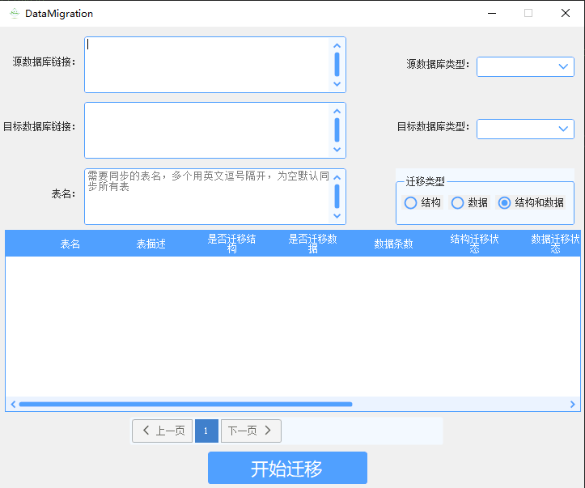

工具概述：
主要功能是进行数据库表结构和数据的迁移。支持大部分主流数据库，通过图形化界面让用户可以方便地创建和管理迁移任务。
基于C/S架构开发。

技术栈：
使用C#编程语言和.NET6框架进行开发。

功能特点：
图形化界面：用户可以通过直观的图形界面来创建迁移任务，设置迁移参数，这大大降低了使用的门槛。
任务管理：用户可以对迁移任务进行各种操作，比如启动、暂停、取消等，还可以查看任务的执行状态。
日志功能：提供了日志输出窗口和日志文件记录功能，帮助用户跟踪迁移过程中的错误和问题，便于调试和问题解决。

支持的数据库：
支持多种数据库，包括Oracle、SQL Server、DM（达梦数据库）、人大金仓、SQLite、DB2、MySQL、PostgreSQL、QuestDb、华为Gauss、PolarDb等。具有广泛的数据库兼容性，能够满足不同用户的需求。

数据类型自动匹配和自动化迁移：
能够根据预置的规则自动匹配不同数据库之间的数据类型，这减少了用户手动配置的工作量。
它不仅能够迁移数据，还能迁移索引、约束等数据库对象，实现了全面的自动化迁移。
